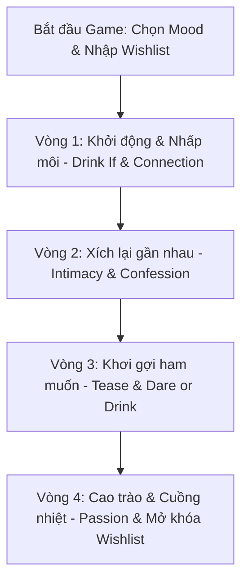

# KẾ HOẠCH THIẾT KẾ GAME TÌNH YÊU CHO HAI TA (LOVE & DRINK - PRIVATE EDITION)

Chào hai bạn! Bản kế hoạch này đã được thiết kế lại hoàn chỉnh để phục vụ mục tiêu duy nhất: **Trở thành một trò chơi tình yêu riêng tư, lãng mạn và nóng bỏng dành riêng cho bạn và người yêu.** 

Chúng ta loại bỏ hoàn toàn các yếu tố thương mại, các câu hỏi an toàn đại trà hay cơ chế giảm nhẹ độ nhạy cảm để bán hàng. Thay vào đó, game sẽ tập trung vào sự kết nối sâu sắc, kỷ niệm riêng tư, những đụng chạm cơ thể tinh tế và các thử thách táo bạo theo mức độ đồng thuận của hai người.

---

## 1. Định hướng & Mục tiêu Cốt lõi
*   **Đối tượng duy nhất:** Bạn và người yêu của bạn.
*   **Nền tảng đề xuất:** Một Web App chạy mượt mà trên điện thoại di động (Mobile-first, lưu trữ dữ liệu offline bảo mật tuyệt đối tại thiết bị của bạn) hoặc có thể in thành bộ bài vật lý nếu muốn.
*   **Giá trị mang lại:**
    *   **Phá băng & Thư giãn:** Khởi động buổi tối với cồn nhẹ (hoặc tùy chọn nước ngọt/nước ép) kết hợp câu hỏi hài hước để rũ bỏ mệt mỏi ngày dài.
    *   **Kết nối tâm hồn:** Những câu hỏi đào sâu vào cảm xúc, kỷ niệm và sự thấu hiểu thầm kín.
    *   **Tăng dần nhiệt độ (Escalation):** Dẫn dắt cảm xúc đi từ nhẹ nhàng (nhìn mắt, ôm) -> gợi cảm (nụ hôn, đụng chạm tinh tế) -> nóng bỏng (thử thách 18+ và ước nguyện thầm kín).
    *   **Không gian an toàn & Riêng tư:** Không thu thập dữ liệu lên server, không có quảng cáo, bảo mật tuyệt đối.

---

## 2. Tính năng Cá nhân hóa Đặc biệt (Chỉ dành cho 2 người)

### A. Custom Memories (Góc kỷ niệm riêng)
*   Hai bạn có thể nhập trước tên, biệt danh của nhau và một vài địa điểm/kỷ niệm đặc biệt của hai người vào phần Cài đặt.
*   Game sẽ tự động lồng ghép các từ khóa này vào nội dung câu hỏi/thử thách một cách tự nhiên.
    *   *Ví dụ: "Uống nếu bạn là người chủ động tỏ tình tại [Địa điểm kỷ niệm]!"*

### B. Secret Wishlist / Fantasy Box (Hộp ước nguyện thầm kín)
*   Trước khi bắt đầu chơi, mỗi người sẽ bí mật nhập từ 3 đến 5 mong muốn thầm kín của mình vào ứng dụng (ví dụ: một tư thế muốn thử, một vị trí hôn mới, một lời khen ngợi đặc biệt, hoặc một mong muốn foreplay).
*   Các ước nguyện này sẽ được mã hóa và lưu ẩn trong hệ thống.
*   Khi hai bạn đạt đủ điểm trên **Desire Meter** hoặc ở vòng cuối **Passion Round**, game sẽ mở khóa ngẫu nhiên một ước nguyện của đối phương và yêu cầu bạn thực hiện hoặc cam kết thực hiện.

### C. Mood Selector (Lựa chọn bầu không khí)
Tùy chỉnh nhịp độ buổi tối trước khi bắt đầu:
*   🌸 **Cozy & Sweet (Chữa lành & Kết nối):** Thích hợp khi mệt mỏi. Không cồn, tập trung chia sẻ cảm xúc, ôm ấp và massage nhẹ nhàng.
*   🍷 **Fun & Tipsy (Vui vẻ & Nhậu nhẹt):** Tập trung vào các lá bài uống, trò đùa tinh nghịch và trò chuyện hài hước.
*   🔥 **Spicy & Passionate (Cuồng nhiệt & Nóng bỏng):** Lược bỏ bớt các câu hỏi dài, tăng nhanh các thử thách chạm, hôn và dẫn dắt nhanh tới cuộc yêu.

---

## 3. Cấu trúc Game & Hệ thống Đo lường



### Chỉ số Cảm xúc & Ham muốn:
*   ❤️ **Heart Meter (Mức độ yêu):** Tăng lên khi hoàn thành các câu hỏi thuộc bộ *Connection* và *Intimacy*. Đạt các mốc nhất định sẽ mở khóa các thử thách tiếp theo.
*   🔥 **Desire Meter (Mức độ lửa):** Tăng lên khi thực hiện các thử thách thể chất thuộc bộ *Tease* và *Passion*. Khi đạt tối đa (100%), game kích hoạt **Final Climax Round** (Vòng Cao Trào) và rút ngẫu nhiên lá bài trong *Secret Wishlist*.

---

## 4. Thiết kế Chi tiết Dữ liệu các Bộ bài (JSON Database)

Để dễ dàng lập trình và chỉnh sửa nội dung sau này, dữ liệu game được tổ chức theo cấu trúc JSON dưới đây với nội dung đã được làm mới hoàn toàn, mang tính cá nhân, sâu sắc và quyến rũ hơn.

```json
{
  "game_info": {
    "name": "Love & Drink - Private Edition",
    "version": "2.0",
    "created_for": "You & Your Partner"
  },
  "decks": {
    "drink": {
      "drink_if": [
        {
          "id": "DI001",
          "text": "Uống 1 ngụm nếu bạn là người yêu đối phương nhiều hơn (nếu cả hai cùng nhận thì cả hai cùng uống)."
        },
        {
          "id": "DI002",
          "text": "Uống 1 ngụm nếu bạn từng lén nhìn đối phương lúc họ đang ngủ rồi tự cười một mình."
        },
        {
          "id": "DI003",
          "text": "Uống 1 ngụm nếu bạn từng ghen tuông vô lý nhưng âm thầm chịu đựng không nói ra."
        },
        {
          "id": "DI004",
          "text": "Uống 1 ngụm nếu bạn từng nghĩ về đám cưới hoặc cuộc sống chung tương lai của hai đứa."
        },
        {
          "id": "DI005",
          "text": "Uống 1 ngụm nếu bạn từng lưu ảnh dìm của đối phương làm hình nền hoặc lưu trong mục bí mật."
        },
        {
          "id": "DI006",
          "text": "Uống 2 ngụm nếu bạn thấy đối phương hấp dẫn nhất là khi họ vừa tắm xong."
        },
        {
          "id": "DI007",
          "text": "Uống 1 ngụm nếu bạn là người chủ động nhắn tin hoặc mở lời trước ở lần hẹn hò đầu tiên."
        }
      ],
      "most_likely": [
        {
          "id": "ML001",
          "text": "Đếm từ 1 đến 3 và cùng chỉ tay vào người dễ giận dỗi vu vơ hơn. Người bị chỉ uống 1 ngụm."
        },
        {
          "id": "ML002",
          "text": "Đếm từ 1 đến 3 và cùng chỉ tay vào người chủ động ôm/hôn nhiều hơn mỗi ngày. Người được chọn uống."
        },
        {
          "id": "ML003",
          "text": "Đếm từ 1 đến 3 và cùng chỉ tay vào người có những suy nghĩ 'đen tối' hơn khi ở cạnh đối phương. Người bị chỉ uống 2 ngụm."
        },
        {
          "id": "ML004",
          "text": "Đếm từ 1 đến 3 và cùng chỉ tay vào người nuông chiều đối phương hơn trong cuộc sống hàng ngày. Người được chọn uống."
        }
      ],
      "confession": [
        {
          "id": "CF001",
          "text": "Kể lại một suy nghĩ quyến rũ/nóng bỏng nhất của bạn về tôi khi hai đứa đang ở nơi đông người, hoặc uống 2 ngụm lớn."
        },
        {
          "id": "CF002",
          "text": "Bộ phận nào trên cơ thể tôi làm bạn dễ bị kích thích và muốn chạm vào nhất? Trả lời thật lòng hoặc uống."
        },
        {
          "id": "CF003",
          "text": "Kể tên một hành động hoặc lời nói của tôi trên giường khiến bạn nhớ mãi và đê mê nhất, hoặc uống 2 ngụm."
        },
        {
          "id": "CF004",
          "text": "Bạn muốn tôi thử vai trò (roleplay) hoặc diện bộ trang phục nào nhất trong cuộc yêu tiếp theo? Trả lời hoặc uống."
        },
        {
          "id": "CF005",
          "text": "Có điều gì trong chuyện thân mật mà bạn muốn thử cùng tôi nhưng trước đây chưa dám nói ra? Hãy thổ lộ hoặc uống."
        }
      ],
      "dare": [
        {
          "id": "DR001",
          "text": "Thì thầm vào tai đối phương một điều cấm kỵ/táo bạo bạn muốn làm với họ tối nay, hoặc uống 2 ngụm."
        },
        {
          "id": "DR002",
          "text": "Hôn nhẹ lên cổ đối phương từ phía sau và giữ trong 15 giây, hoặc uống 1 ngụm."
        },
        {
          "id": "DR003",
          "text": "Dùng môi vẽ lại nhẹ nhàng đường viền xương quai xanh của đối phương, hoặc uống 2 ngụm."
        },
        {
          "id": "DR004",
          "text": "Nhắm mắt lại và để đối phương dùng ngón tay mơn trớn đôi môi của bạn trong 30 giây mà không được cười, hoặc uống."
        }
      ]
    },
    "love": {
      "connection": [
        {
          "id": "LC001",
          "text": "Khoảnh khắc chính xác nào trong quá khứ khiến bạn nhận ra mình thực sự đã yêu tôi sâu sắc?",
          "heart_reward": 2
        },
        {
          "id": "LC002",
          "text": "Nếu được quay lại ngày đầu tiên gặp nhau, bạn muốn thay đổi điều gì để lần đầu ấy lãng mạn hơn nữa?",
          "heart_reward": 2
        },
        {
          "id": "LC003",
          "text": "Hành động nhỏ nhặt thường ngày nào của tôi khiến bạn cảm thấy được yêu thương và trân trọng nhất?",
          "heart_reward": 2
        },
        {
          "id": "LC004",
          "text": "Có điều gì ở tôi khiến bạn cảm thấy an tâm và tin tưởng nhất khi hai đứa gặp khó khăn?",
          "heart_reward": 2
        },
        {
          "id": "LC005",
          "text": "Nếu được chọn một bài hát hoặc một bộ phim để mô tả tình yêu của hai đứa, bạn sẽ chọn tác phẩm nào?",
          "heart_reward": 3
        }
      ],
      "intimacy": [
        {
          "id": "LI001",
          "text": "Đặt tay lên tim của nhau, cảm nhận nhịp đập và nhìn sâu vào mắt đối phương trong 45 giây không nói lời nào.",
          "heart_reward": 3,
          "desire_reward": 1
        },
        {
          "id": "LI002",
          "text": "Nhắm mắt lại và để đối phương hôn nhẹ lên bất kỳ 3 vị trí nào trên khuôn mặt bạn (trừ môi).",
          "heart_reward": 2,
          "desire_reward": 2
        },
        {
          "id": "LI003",
          "text": "Hãy luồn tay qua tóc hoặc massage nhẹ nhàng vùng gáy của đối phương trong vòng 1 phút.",
          "heart_reward": 3,
          "desire_reward": 1
        },
        {
          "id": "LI004",
          "text": "Hãy ôm đối phương thật chặt từ phía sau, hít hà mùi hương trên cơ thể họ trong 30 giây.",
          "heart_reward": 3,
          "desire_reward": 2
        }
      ],
      "tease": [
        {
          "id": "LT001",
          "text": "Hôn kiểu Pháp thật sâu và nồng nàn trong 30 giây, nhưng hai bạn không được phép chạm tay vào cơ thể đối phương.",
          "heart_reward": 2,
          "desire_reward": 4
        },
        {
          "id": "LT002",
          "text": "Dùng hơi thở ấm áp thổi nhẹ vào tai đối phương, thì thầm một câu nói quyến rũ bằng giọng trầm nhất của bạn.",
          "heart_reward": 1,
          "desire_reward": 4
        },
        {
          "id": "LT003",
          "text": "Hãy cởi bỏ một món đồ trên người đối phương (hoặc tự cởi của mình) chỉ bằng một tay hoặc bằng răng.",
          "heart_reward": 1,
          "desire_reward": 5
        },
        {
          "id": "LT004",
          "text": "Dùng ngón tay vuốt ve từ dái tai đối phương, trượt dài xuống cổ rồi dừng lại ở cúc áo đầu tiên của họ trong 20 giây.",
          "heart_reward": 2,
          "desire_reward": 4
        }
      ],
      "passion": [
        {
          "id": "LP001",
          "text": "Kích hoạt Hộp ước nguyện: Rút ngẫu nhiên và thực hiện ngay 1 mong muốn bí mật từ Wishlist của đối phương.",
          "heart_reward": 3,
          "desire_reward": 10
        },
        {
          "id": "LP002",
          "text": "Để đối phương bịt mắt bạn bằng một chiếc khăn mỏng, sau đó họ sẽ hôn và chạm nhẹ vào 3 điểm nhạy cảm tùy ý trên cơ thể bạn.",
          "heart_reward": 2,
          "desire_reward": 8
        },
        {
          "id": "LP003",
          "text": "Bế hoặc ôm chặt đối phương vào lòng, nhìn thẳng vào mắt họ và nói câu mật ngọt táo bạo nhất mà bạn muốn thực hiện ngay bây giờ.",
          "heart_reward": 4,
          "desire_reward": 7
        },
        {
          "id": "LP004",
          "text": "Hôn đối phương ở vùng nhạy cảm nhất trên cơ thể mà bạn biết họ yêu thích trong vòng ít nhất 45 giây.",
          "heart_reward": 3,
          "desire_reward": 9
        }
      ]
    }
  }
}
```

---

## 6. Ý tưởng Thiết kế Giao diện (UI/UX Concept)
Vì đây là ứng dụng tình yêu riêng tư được sử dụng trong không gian lãng mạn (thường là phòng ngủ với ánh sáng mờ), thiết kế cần đạt được các tiêu chuẩn thẩm mỹ cao:

*   **Bảng màu lãng mạn & huyền bí:** 
    *   Màu nền chính: Tím đêm đậm (`#120826`), Đỏ rượu vang sâu (`#2b0414`).
    *   Màu nhấn (Accent): Vàng hổ phách ấm áp (`#ffb703`), Hồng neon dịu nhẹ (`#ff4d6d`).
*   **Phong cách Glassmorphic:** Các lá bài sẽ có hiệu ứng kính mờ thời thượng, viền phát sáng nhẹ (glow effect) tạo cảm giác huyền ảo như ánh nến.
*   **Hiệu ứng lật bài mượt mà:** Micro-animations khi rút bài và lật bài tạo sự hồi hộp và thích thú.
*   **Chế độ màn hình mờ (Privacy Screen):** Khi đến lượt đối phương nhập Wishlist hoặc trả lời câu hỏi nhạy cảm, giao diện có nút "Che màn hình" để người kia không nhìn thấy.
*   **Trình phát nhạc tích hợp (BGM Player):** Tích hợp sẵn một danh sách nhạc Lofi Chill hoặc Acoustic lãng mạn chạy ngầm, tạo nhịp điệu hoàn hảo cho đêm hẹn hò.

---

## 7. Các Bước Triển khai Lập trình Tiếp theo
1.  **Bước 1:** Xây dựng khung ứng dụng Web tĩnh (HTML/CSS/JS) Single-Page, sử dụng các thư viện hoạt họa mượt mà (như GSAP hoặc CSS Transitions).
2.  **Bước 2:** Viết logic quản lý lượt chơi, tính điểm Heart/Desire, quản lý bộ bài để tránh trùng lặp.
3.  **Bước 3:** Hiện thực hóa tính năng mã hóa cục bộ "Hộp ước nguyện thầm kín" (Secret Wishlist) sử dụng LocalStorage.
4.  **Bước 4:** Tối ưu hóa hiển thị di động để hai bạn có thể nằm trên giường truyền tay nhau chơi cực kỳ thoải mái.

*Bản kế hoạch này đã sẵn sàng để chuyển hóa thành những dòng code tuyệt mỹ. Hai bạn hãy cùng tận hưởng nhé!*
